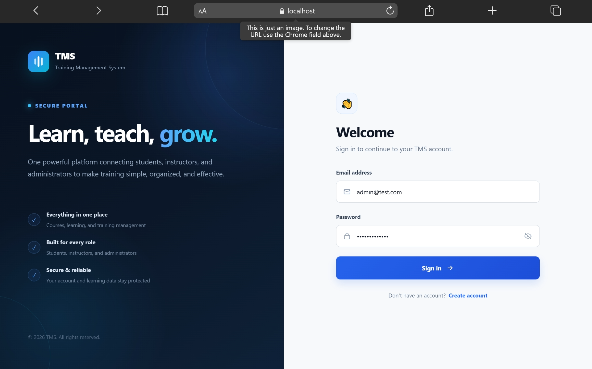
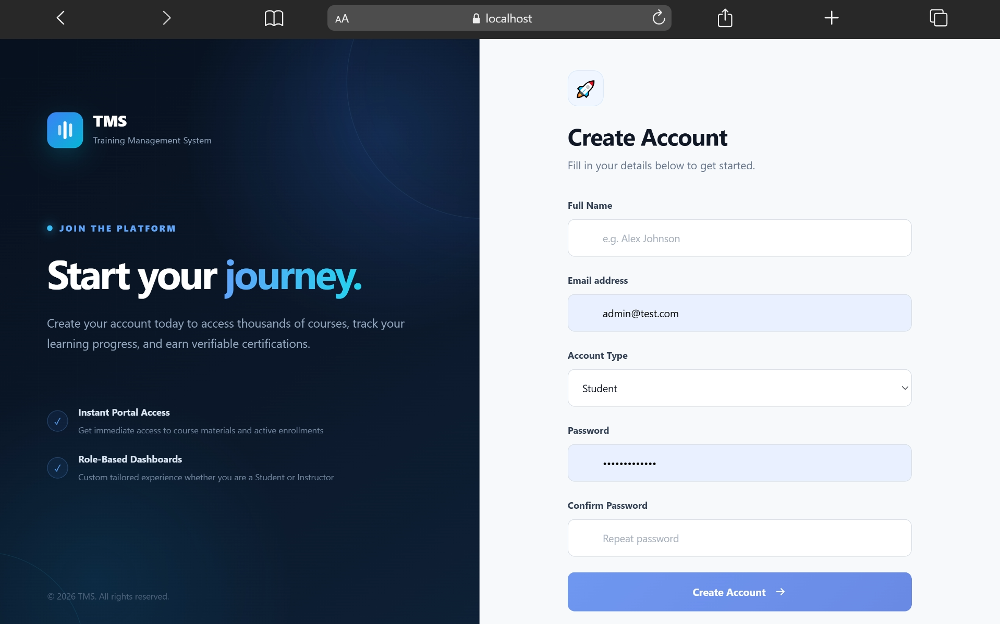
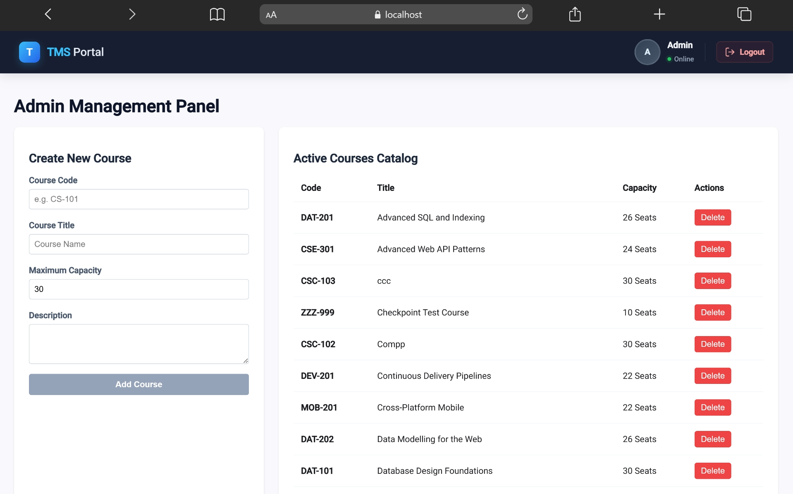
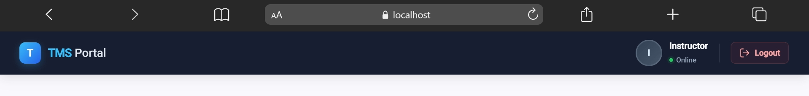
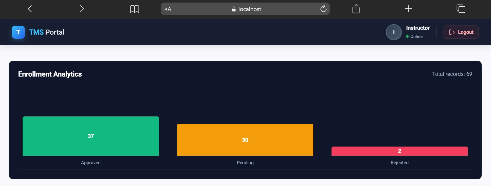

Yes. The problem is most likely the **image filenames in the README don't match the actual filenames**. Your current README also references six screenshots, while the files you provided are five PNG files.

Since your images are in the **same directory as `README.md`**, the cleanest approach is to use simple relative paths:

```markdown

```

rather than the old `.jpg` filenames.

Here is a rewritten version of your README using the filenames of the images you provided:

````markdown
# Training Management System (TMS)

An enterprise-grade full-stack **Training Management System (TMS)** designed to streamline course registration, enrollment processing, and academic progress tracking.

Built with **ASP.NET Core Web API** and **Angular 19**, the platform provides a role-based environment tailored for **Students, Instructors, and Administrators**.

---

## Key Features

### 🔐 Authentication & Access Control

- **JWT-Based Authentication** – Secure authentication using JWT access and refresh tokens.
- **Role-Based Access Control** – Dedicated experiences for `Student`, `Instructor`, and `Admin` users.
- **User Registration** – New users can create accounts and select their appropriate account type.
- **Secure Login** – Authenticated users are automatically directed to their role-specific portal.

---

### 🎓 Student Dashboard

- **Course Catalog** – Browse available courses and view course information.
- **Seat Availability** – Courses display their current capacity and availability.
- **Course Enrollment** – Students can submit enrollment requests for available courses.
- **Enrollment Tracking** – Students can monitor the status of their enrollment requests.
- **Academic Progress** – Track credits, active enrollments, and academic progress.

---

### 👨‍🏫 Instructor Portal

- **Enrollment Management** – View students who have requested enrollment.
- **Approval Workflow** – Approve or reject pending enrollment requests.
- **Course Rosters** – View enrolled students by course.
- **Enrollment Analytics** – Visualize enrollment statistics including:
  - Approved enrollments
  - Pending enrollments
  - Rejected enrollments
  - Total enrollment records

---

### 🛠️ Administrator Panel

- **Course Management** – Create and delete courses.
- **Course Configuration** – Define course codes, titles, descriptions, and maximum capacity.
- **Course Catalog** – View all active courses in one centralized interface.
- **Capacity Management** – Configure the maximum number of students allowed in each course.

---

## Tech Stack

### Backend

- **ASP.NET Core 8 Web API**
- **Entity Framework Core**
- **PostgreSQL**
- **ASP.NET Core Identity**
- **JWT Authentication**

### Frontend

- **Angular 19**
- **Standalone Components**
- **Angular Signals**
- **RxJS**
- **SCSS**

### Development Tools

- Visual Studio Code
- Git & GitHub
- Node.js
- .NET 8 SDK
- PostgreSQL

---

# Screenshots

## Authentication & Onboarding

### Login Portal


### Registration Portal



---

## Administrator Experience

### Admin Management Panel



The administrator dashboard provides centralized course management, allowing administrators to create courses, configure capacity, and manage the active course catalog.

---

## Instructor Experience

### Instructor Portal



The instructor portal provides a dedicated environment for managing course enrollments and instructor-specific activities.

### Enrollment Analytics



The analytics dashboard provides a visual overview of enrollment activity, including approved, pending, and rejected enrollment requests.

---

# API Endpoint Summary

## Authentication

### `/api/Auth`

| Method | Endpoint | Description |
|---|---|---|
| `POST` | `/api/Auth/register` | Register a new Student or Instructor account |
| `POST` | `/api/Auth/login` | Authenticate a user and issue JWT/Refresh tokens |
| `POST` | `/api/Auth/refresh` | Generate a new access token using a valid refresh token |

---

## Courses

### `/api/v1/courses`

| Method | Endpoint | Description |
|---|---|---|
| `GET` | `/api/v1/courses` | Retrieve the paginated course catalog |
| `GET` | `/api/v1/courses/{id}` | Retrieve details for a specific course |
| `POST` | `/api/v1/courses` | Create a new course (`Admin` only) |
| `DELETE` | `/api/v1/courses/{id}` | Delete an existing course (`Admin` only) |

---

## Enrollments

### `/api/v1/enrollments`

| Method | Endpoint | Description |
|---|---|---|
| `GET` | `/api/v1/enrollments` | Retrieve student enrollment records |
| `POST` | `/api/v1/enrollments` | Submit a course enrollment request |
| `PUT` | `/api/v1/enrollments/{id}/approve` | Approve a pending enrollment (`Instructor` only) |
| `PUT` | `/api/v1/enrollments/{id}/reject` | Reject a pending enrollment (`Instructor` only) |

---

# Project Structure

```text
TMS/
│
├── TmsApi/
│   ├── Api/
│   │   └── Controllers/
│   │       └── AuthController.cs
│   │
│   ├── Domain/
│   │   └── Entities/
│   │       ├── TmsUser.cs
│   │       ├── Course.cs
│   │       └── RefreshToken.cs
│   │
│   ├── Infrastructure/
│   │   ├── Persistence/
│   │   │   └── DbContext & Entity Configurations
│   │   │
│   │   └── Services/
│   │       ├── Token Services
│   │       ├── Email Services
│   │       └── Identity Services
│   │
│   └── Program.cs
│
├── tms-client/
│   └── src/
│       └── app/
│           ├── features/
│           │   ├── admin-courses/
│           │   ├── instructor/
│           │   ├── login/
│           │   ├── register/
│           │   └── student-dashboard/
│           │
│           ├── models/
│           │
│           ├── services/
│           │   ├── auth.service.ts
│           │   ├── course.service.ts
│           │   └── enrollment.service.ts
│           │
│           └── store/
│
├── Macbook-Air-localhost-0.png
├── Macbook-Air-localhost-1.png
├── Macbook-Air-localhost-2.png
├── Macbook-Air-localhost-3.png
├── Macbook-Air-localhost-4.png
│
└── README.md
````

---

# Getting Started

## Prerequisites

Make sure the following are installed:

* [.NET 8 SDK]
* Node.js 18+
* Angular CLI
* PostgreSQL
* Git

---

## 1. Clone the Repository

```bash
git clone https://github.com/Estif7/TMS-QIYAS.git
cd TMS-QIYAS
```

---

## 2. Backend Setup

Navigate to the API project:

```bash
cd TmsApi
```

Restore the required packages:

```bash
dotnet restore
```

Apply the Entity Framework database migrations:

```bash
dotnet ef database update
```

Run the API:

```bash
dotnet run
```

The API runs by default on:

```text
http://localhost:5121
```

---

## 3. Frontend Setup

Navigate to the Angular project:

```bash
cd tms-client
```

Install dependencies:

```bash
npm install
```

Start the Angular development server:

```bash
ng serve
```

The frontend will be available at:

```text
http://localhost:4200
```

---

# Configuration

## PostgreSQL

Configure the database connection in:

```text
TmsApi/appsettings.json
```

Example:

```json
{
  "ConnectionStrings": {
    "DefaultConnection": "Host=localhost;Database=TmsDb;Username=postgres;Password=yourpassword"
  }
}
```

---

## JWT Configuration

Configure JWT authentication in `appsettings.json`:

```json
{
  "Jwt": {
    "Issuer": "TMSApi",
    "Audience": "TMSClient",
    "Key": "YOUR_SUPER_SECRET_JWT_KEY_THAT_IS_LONG_ENOUGH"
  }
}
```

> **Important:** Never commit real database passwords, JWT secrets, API keys, or other credentials to GitHub.

---

# User Roles

The system currently supports three primary roles:

| Role           | Responsibilities                                                |
| -------------- | --------------------------------------------------------------- |
| **Student**    | Browse courses, request enrollment, and track enrollment status |
| **Instructor** | Manage enrollment requests and view enrollment analytics        |
| **Admin**      | Create, configure, and delete courses                           |

---

# Future Improvements

Potential future enhancements include:

* Course scheduling and calendars
* Instructor course assignment
* Student grades and assessment management
* Attendance tracking
* Email notifications
* Advanced reporting and analytics
* Certificate generation
* File and learning-material management
* Search and filtering
* Pagination and advanced course discovery
* Audit logs
* Automated testing
* Docker-based deployment
* Production deployment and CI/CD

---

# License

This project is licensed under the MIT License.

````